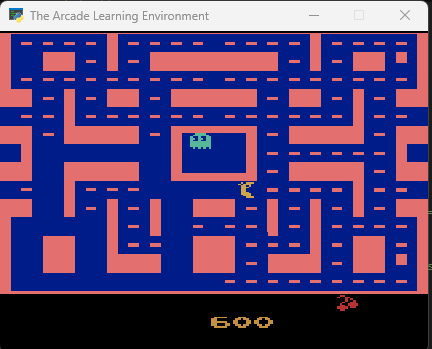
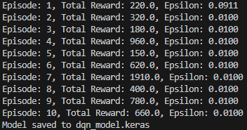

# KELOMPOK 4 Reinforcement Learning
| Name                         | NRP        |
| ---------------------------- | ---------- |
| Muhammad Ihsan Al Khwaritsmi | 5025221211 |
| Nyoman Satyawikrama Upadhana | 5025221194 |
| I Putu Raditya Partha WIjaya | 5025221210 |
| Putu Indra Mahendra | 5025221215 |
| Farhan Widyanto Wibowo  | 5025221209 |
# Laporan Proyek Reinforcement Learning (DQN untuk Ms. Pac-Man)

Proyek ini mengimplementasikan agen Deep Q-Network (DQN) untuk bermain game Ms. Pac-Man menggunakan lingkungan Gymnasium dan TensorFlow.

## I. Pengaturan Environment

Environment permainan Ms. Pac-Man dibuat menggunakan library Gymnasium, penerus OpenAI's Gym, yang berinteraksi dengan Arcade Learning Environment (ALE). Beberapa `wrapper` diterapkan untuk melakukan preprocessing pada frame game, membuatnya lebih cocok untuk training neural network.

Fungsi `make_env` bertanggung jawab untuk:
- Membuat base environment Ms. Pac-Man.
- Melakukan `resize observation` menjadi 84x84 piksel.
- Mengubah `observation` menjadi `grayscale`.
- Melakukan `frame stacking` 4 frame berturut-turut untuk menangkap informasi temporal (gerakan).

Berikut adalah contoh environment Ms. Pac-Man:

## II. Model Deep Q-Network (DQN)

Agen menggunakan Deep Q-Network (DQN) untuk mempelajari `optimal policy`. DQN adalah `convolutional neural network` (CNN) yang mengambil frame game yang sudah diproses sebagai input dan menghasilkan `Q-values` untuk setiap `action` yang mungkin.

Arsitektur model DQN terdiri dari:
- `Input layer` yang menerima tumpukan 4 frame (84x84 piksel).
- `Permute layer` untuk mengubah dimensi input agar sesuai dengan format `channels_last` yang diharapkan oleh TensorFlow.
- Tiga `convolutional layer` (`Conv2D`) dengan `activation function` ReLU untuk mengekstraksi fitur dari frame game.
- `Flatten layer` untuk meratakan output konvolusional.
- Dua `Dense layer` dengan `activation function` ReLU dan linear untuk menghasilkan `Q-values` untuk setiap `action`.

## III. Replay Buffer

Untuk menstabilkan training, sebuah `replay buffer` digunakan untuk menyimpan `experience` agen (`state`, `action`, `reward`, `next_state`, `done`). Agen kemudian mengambil sampel acak dari `buffer` ini untuk training model DQN. Ini membantu memutus korelasi antara `consecutive experiences` dan meningkatkan stabilitas proses training.

## IV. Agen DQN

Class `DQNAgent` merangkum `behavior` agen, termasuk:
- **Main DQN model**: Digunakan untuk `action selection` dan training.
- **Target network**: Salinan dari `main model` yang diupdate secara periodik untuk menghitung `target Q-values`, membantu menstabilkan training.
- **Replay buffer**: Untuk menyimpan dan mengambil sampel `experience`.
- **Epsilon-Greedy policy**: Untuk menyeimbangkan `exploration` (mencoba `action` baru) dan `exploitation` (mengambil `action` terbaik yang diketahui). Nilai `epsilon` berkurang seiring waktu.
- **Adam Optimizer** dan **Huber loss function**: Digunakan untuk training model.

## V. Training Loop

`Training loop` adalah inti dari proses pembelajaran. Dalam setiap `episode`:
1. Agen berinteraksi dengan `environment`, memilih `action` berdasarkan `epsilon-greedy policy`.
2. `Experience` (`state`, `action`, `reward`, `next_state`, `done`) disimpan dalam `replay buffer`.
3. Agen melakukan training model DQN menggunakan sampel dari `replay buffer`.
4. `Target model` diupdate secara periodik untuk menstabilkan training.

Berikut adalah contoh hasil training per `episode`:

## Kesimpulan

Proyek ini berhasil mengimplementasikan agen DQN untuk bermain Ms. Pac-Man. Dengan menggunakan teknik seperti `frame preprocessing`, `replay buffer`, dan `target model`, agen dapat belajar `effective policy` untuk memaksimalkan `reward` dalam permainan.
